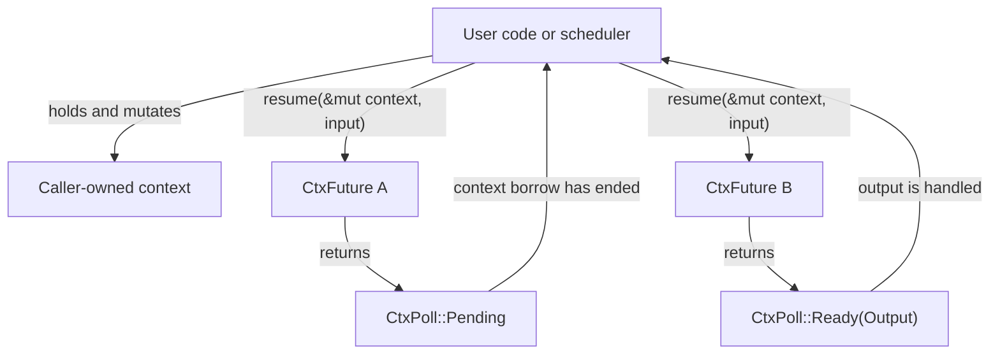

# ctx-future

`ctx-future` provides future-like resumable computations that borrow caller-owned
context only while being resumed.

Use it when a scheduler owns some shared context and needs to keep one or more
computations in a pending state. Each computation stores its own continuation
state, but it does not keep a mutable borrow of the context after `resume`
returns.

The crate is intentionally standalone. It does not depend on `mpi-rs`, and it
does not expose task, queue, message, session, call, or stream concepts.

## Core idea

The main trait is `CtxFuture<Cx, Input = ()>`:

```rust
use ctx_future::{CtxFuture, CtxPoll};

struct WaitOnce {
    resumed_before: bool,
}

impl CtxFuture<Vec<&'static str>> for WaitOnce {
    type Output = usize;

    fn resume(&mut self, cx: &mut Vec<&'static str>, (): ()) -> CtxPoll<Self::Output> {
        cx.push("resumed");

        if self.resumed_before {
            CtxPoll::Ready(cx.len())
        } else {
            self.resumed_before = true;
            CtxPoll::Pending
        }
    }
}

let mut cx = Vec::new();
let mut future = WaitOnce {
    resumed_before: false,
};

assert_eq!(future.resume(&mut cx, ()), CtxPoll::Pending);

// The context borrow ended when resume returned, so the caller can use it.
cx.push("used by scheduler");

assert_eq!(future.resume(&mut cx, ()), CtxPoll::Ready(3));
```

`CtxPoll::Pending` means "store this future and try again later."
`CtxPoll::Ready(value)` means "the computation is complete."

## Usage Design

From a user's perspective, the scheduler owns the context and decides when each
ctx-future is resumed:



The important ownership rule is that the mutable borrow of `Context` exists
only during the `resume` call. Once `resume` returns, the scheduler can mutate
the context, resume another future, store pending futures, or drop them.

## Closure-Based Futures

For small computations, use `resume_fn` instead of declaring a struct:

```rust
use ctx_future::{CtxFuture, CtxPoll, resume_fn};

let mut first_resume = true;
let mut future = resume_fn(|cx: &mut usize, step: usize| {
    *cx += step;

    if first_resume {
        first_resume = false;
        CtxPoll::Pending
    } else {
        CtxPoll::Ready(*cx)
    }
});

let mut total = 0;

assert!(future.resume(&mut total, 2).is_pending());
assert_eq!(total, 2);

total += 10;

assert_eq!(future.resume(&mut total, 3), CtxPoll::Ready(15));
```

The closure can keep its own captured state, such as `first_resume` above. The
context still belongs to the caller.

## Handling Errors

`ctx-future` does not have a separate error channel. Return `Result<T, E>` as
the future output when the computation can fail.

```rust
use ctx_future::{CtxFuture, CtxPoll, resume_fn};

#[derive(Debug, Eq, PartialEq)]
enum ReserveError {
    NotEnoughCapacity,
}

#[derive(Default)]
struct Pool {
    capacity: usize,
    used: usize,
}

let mut reserve = resume_fn(|pool: &mut Pool, amount: usize| {
    if pool.used + amount > pool.capacity {
        CtxPoll::Ready(Err(ReserveError::NotEnoughCapacity))
    } else {
        pool.used += amount;
        CtxPoll::Ready(Ok(pool.used))
    }
});

let mut pool = Pool {
    capacity: 4,
    used: 0,
};

assert_eq!(reserve.resume(&mut pool, 3), CtxPoll::Ready(Ok(3)));
assert_eq!(
    reserve.resume(&mut pool, 2),
    CtxPoll::Ready(Err(ReserveError::NotEnoughCapacity))
);
```

Treat `Pending` as a scheduling state, not an error. If a pending computation
later discovers a failure, return `CtxPoll::Ready(Err(error))`.

## Managing Several Pending Futures

Because pending futures do not retain context borrows, a scheduler can keep many
of them and resume whichever one is ready to make progress.

```rust
use ctx_future::{CtxFuture, CtxPoll};

#[derive(Default)]
struct SchedulerContext {
    ticks: u32,
    log: Vec<&'static str>,
}

struct Delay {
    name: &'static str,
    remaining: u32,
}

impl CtxFuture<SchedulerContext> for Delay {
    type Output = &'static str;

    fn resume(&mut self, cx: &mut SchedulerContext, (): ()) -> CtxPoll<Self::Output> {
        cx.log.push(self.name);

        if self.remaining == 0 {
            CtxPoll::Ready(self.name)
        } else {
            self.remaining -= 1;
            CtxPoll::Pending
        }
    }
}

let mut cx = SchedulerContext::default();
let mut jobs: Vec<Option<Box<dyn CtxFuture<SchedulerContext, Output = &'static str>>>> = vec![
    Some(Box::new(Delay {
        name: "fast",
        remaining: 0,
    })),
    Some(Box::new(Delay {
        name: "slow",
        remaining: 2,
    })),
];
let mut completed = Vec::new();

while completed.len() < jobs.len() {
    cx.ticks += 1;

    for job in &mut jobs {
        let Some(future) = job else {
            continue;
        };

        if let CtxPoll::Ready(name) = future.resume(&mut cx, ()) {
            completed.push(name);
            *job = None;
        }
    }
}

assert_eq!(completed, ["fast", "slow"]);
assert_eq!(cx.ticks, 3);
```

This is the shape `mpi-rs` can build on later for task-local suspended handler
continuations: the runtime can own task context, keep pending continuations, and
resume one continuation at a time without blocking the task thread.

## API Notes

- Implement `CtxFuture<Cx, Input>` when a computation needs explicit state.
- Use `resume_fn` for small closure-based computations.
- Use `CtxPoll::map` to transform a ready value while preserving `Pending`.
- Use `CtxPoll::into_ready` when an `Option<T>` is more convenient.
- Store boxed trait objects such as `Box<dyn CtxFuture<Cx, Output = T>>` when a
  scheduler needs heterogeneous future values with the same context and output.
